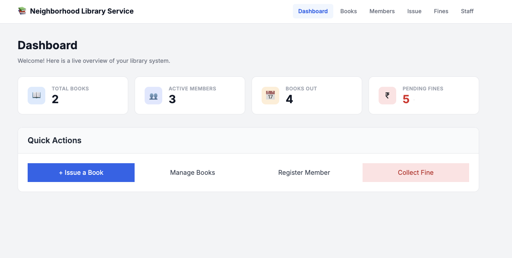
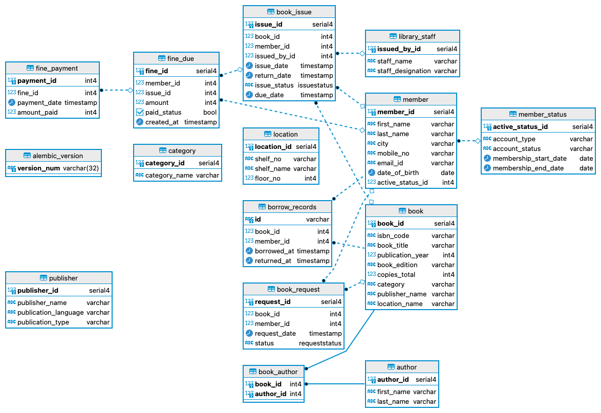

# 📚 Neighborhood Library App

A robust, full-stack Neighborhood Library Service designed to handle books, memberships, book issues, fines, and staff administration with a beautiful and modern UI.

---

## 🚀 Tech Stack & Requirements

### Minimum Requirements
- **Container Engine**: Docker or Podman (Recommended for running the full stack)
- **Node.js**: `v20.x`+ (Only if running frontend locally)
- **Python**: `3.10+` (Only if running backend locally)
- **Package Manager**: `pnpm` (Only if running frontend locally)

### Technologies Used
- **Frontend**: Next.js (React), Vanilla CSS, React Hot Toast, Axios
- **Backend**: FastAPI (Python), Uvicorn, SQLAlchemy (ORM), Alembic (Migrations)
- **Database**: PostgreSQL (Containerized)
- **Containerization**: Docker Compose / Podman Compose

---

## ⚙️ Configuration & Environment Setup

Before starting the project, you need to configure the environment variables for both the backend and the frontend.

### 1. Backend Configuration
Create a `.env` file in the `backend/` directory:
```bash
# backend/.env

# Database Configuration
POSTGRES_DB=library
POSTGRES_USER=postgres
POSTGRES_PASSWORD=postgres
POSTGRES_HOST=db
POSTGRES_PORT=5432
DATABASE_URL=postgresql://postgres:postgres@db:5432/library

# Application Configuration
APP_ENV=development
SECRET_KEY=your_super_secret_key

# CORS Settings (Comma-separated list of allowed frontend URLs)
FRONTEND_URLS=http://localhost:3000,http://127.0.0.1:3000
```

### 2. Frontend Configuration
Create a `.env` file in the `frontend/` directory:
```bash
# frontend/.env

# The base URL pointing to the backend API
NEXT_PUBLIC_API_URL=http://localhost:8000/api
```

---

## 🛠️ Step-by-Step Installation & Running

### Step 1: Start the Application Services
We use Docker/Podman to containerize the entire stack, including the PostgreSQL database, FastAPI backend, and Next.js frontend.

Navigate to the root directory and start all services:
```bash
# Using Podman
podman-compose up -d --build

# Using Docker
docker-compose up -d --build
```
> **Success!**
> - **Frontend**: `http://localhost:3000`
> - **Backend API**: `http://localhost:8000`
> - **API Docs**: `http://localhost:8000/docs`

### Step 2: Database Migrations
Once the containers are running, you need to initialize the database schema using Alembic.
```bash
# Using Podman
podman-compose exec backend alembic upgrade head

# Using Docker
docker-compose exec backend alembic upgrade head
```

### Step 3: Run Database Seeders
To populate the database with initial testing data (books, members, publishers, categories), run the seeder script.
```bash
# Using Podman
podman-compose exec backend python -m app.seed

# Using Docker
docker-compose exec backend python -m app.seed
```

---

## 🧹 Database Management Commands

If you need to reset the database or recreate migrations during development, use the following commands:

**Truncate all data cleanly:**
```bash
podman-compose exec db psql -U postgres -d library -c "TRUNCATE category, publisher, location, book, member, author, book_issue, book_request, library_staff RESTART IDENTITY CASCADE;"
```

**Generate a new Alembic migration:**
```bash
podman-compose exec backend alembic revision --autogenerate -m "migration_name"
```

## 🧪 Running Unit Tests

### 1. Backend Tests (Python/Pytest)
You can run the backend tests either inside the container or locally.

**Using Docker/Podman:**
```bash
# Using Podman
podman-compose exec backend pytest

# Using Docker
docker-compose exec backend pytest
```

**Locally:**
```bash
cd backend
pytest
```

### 2. Frontend Tests (React/Jest)
You can run the frontend tests either inside the container or locally.

**Using Docker/Podman:**
```bash
# Using Podman
podman-compose exec frontend npm test

# Using Docker
docker-compose exec frontend npm test
```

**Locally:**
```bash
cd frontend
pnpm test
```

**DASHBOARD**:



**BOOK ISSUE**:


**ER DIAGRAM:**



**APPLICATION FLOW:**


